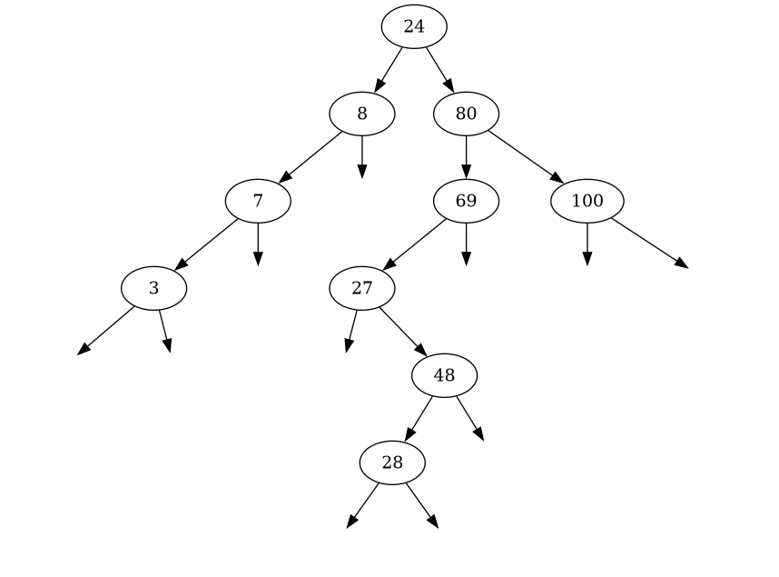

# TREE

Tree data structure implementation and visualization (simple and naive).



### Quick Start

How to visualize the output: (graphviz needed)

```console
make -B
./build/tree --output <output.dot>
dot -Tpng <output.dot> -o <output.png>
xdg-open output.png
```
